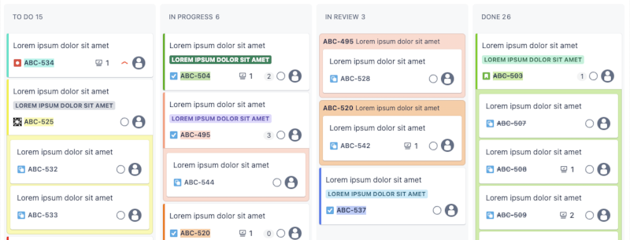

# Jira customise Chrome extension

This extension enhances a Jira board's appearance. This can be useful if you don't have control over the board settings.

The extension is optimised for Sprint Boards in Jira Cloud. I have not tested it with other board types, the backlog etc.

## Installation

1. Clone / download this code.
2. Open [./manifest.json](./manifest.json) in your code editor of choice and update `content_scripts.matches` to your Jira board's URL. The extension will only affect the URLs / globs you define there. For more information on allowed values, see the [Chrome extension development documentation](https://developer.chrome.com/docs/extensions/mv3/manifest/content_scripts/#match-urls).
3. Open `chrome://extensions/` in Chrome.
4. With "Developer mode" enabled, click "Load unpacked". Then select this extension's folder.
5. Open or reload your Jira board tab in Chrome to see the extension in action.

## Usage

The extension is enabled by default. So it should be applied automatically after installation once you open / reload your Jira sprint board page.

The extension comes with an icon for the task bar in Chrome. If you want to enable or disable the extension often, you might find it useful to pin the extension to your task bar. Clicking the icon toggles the extension to be enabled or disabled. **Don't forget that you'll have to reload your Jira board tab to see this change being applied.**

## Extension Options – enable / disable individual features

The extension has an options page that allows you to enable / disable features.

The options page can be reached as follows:

- If the extension icon is pinned to the task bar, right-click on the icon and select "Options".
- Alternatively, go to `chrome://extensions/`. Click the "Details" link for this extension and then click "Extension options".

The options page popup lists all the features supported by this extension. Use the checkboxes to enable / disable the features you like and click "Save" to store your preferences. **Don't forget that you'll have to reload your Jira board tab to see this changes being applied.**

## Features

### Colour-coding of tickets in a sprint board

_This feature is **enabled by default** in the extension options._

This feature applies a colour of a predefined set to each ticket on the board that is not a sub-task.

The ticket's ID as well as the wrapper around the ticket's sub-tasks, if any, get that colour applied as their background colour. This way, it's easier to quickly see which sub-tasks in a board's columns belong to which parent ticket.

The chosen colours are based on the tickets' IDs, i.e. they don't change even when reloading the page.

#### How to change the defined colours?

The list of available colours is defined in [./content-scripts/features/colorize-board.js](./content-scripts/features/colorize-board.js).

Since there is a finite list, it can happen that multiple tickets in a sprint get the same colour assigned.

If that bothers you, or you want to add / remove / change any colour:

1. Update the list of colours to your liking.
2. Open `chrome://extensions/` in Chrome and click the little reload icon (that's the arrow going in a circle) for this extension, so that Chrome reads your code changes.
3. Open or reload the tab with your Jira board to see the changes being applied.

To make it a bit easier to pick new colours, you can open the [./content-scripts/features/colour-picker-helper.html](./content-scripts/features/colour-picker-helper.html) file in your browser. It shows all the colours defined in that file as card-like elements. You can play around with the colours e.g. by using the devTools without having to constantly reload the extension. Once you're happy with the colours, replace the list in [./content-scripts/features/colorize-board.js](./content-scripts/features/colorize-board.js) with your updated colour values.

## Development resources

- Options page that allows users to define options for the extension: https://developer.chrome.com/docs/extensions/develop/ui/options-page
